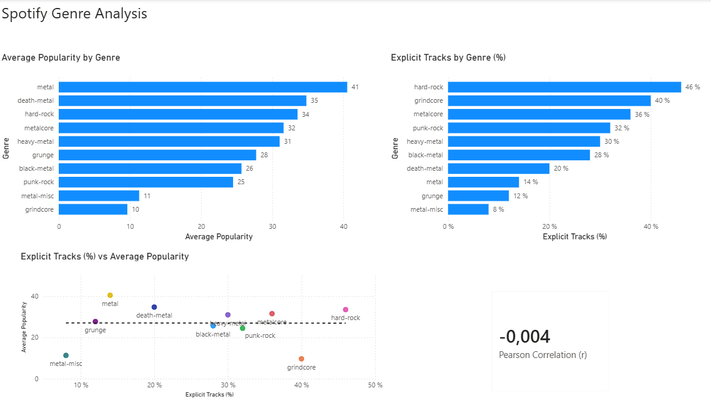

# Spotify Genre Analysis

A small data analytics project exploring popularity and explicit-content patterns across selected heavy-music genres using **Power BI, Power Query, and DAX**.

## Project Goal

The project investigates three main questions:

1. Which selected genres have the highest average track popularity?
2. Which genres have the highest percentage of explicit tracks?
3. Is the prevalence of explicit tracks associated with average genre popularity?

## Dataset

The analysis uses a Spotify track dataset containing information such as:

- Track name
- Genre
- Artist
- Album
- Popularity
- Track duration
- Explicit-content status

For this analysis, I selected 10 genre categories from the source dataset, primarily representing heavier rock and metal styles:

- metal
- death-metal
- hard-rock
- metalcore
- heavy-metal
- black-metal
- punk-rock
- grindcore
- grunge
- metal-misc

**Note:** metal-misc is the source dataset's miscellaneous metal category (misc = miscellaneous).

Each selected genre contains 50 tracks.

`popularity` represents Spotify's 0–100 track popularity score rather than a percentage. In this project, Average Popularity is calculated as the arithmetic mean of the track popularity scores within each genre.

**Dataset source:** [Spotify Dataset for Playing Around with SQL on Kaggle](https://www.kaggle.com/datasets/ambaliyagati/spotify-dataset-for-playing-around-with-sql)

## Tools Used

- **Power BI** – dashboard creation and visualization
- **Power Query** – filtering, transformation, grouping and merging data
- **DAX** – calculation of the Pearson correlation coefficient

## Data Preparation

The dataset was transformed in Power Query by:

- Filtering the dataset to selected genres
- Grouping tracks by genre
- Calculating average popularity
- Converting the `explicit` TRUE/FALSE field into a numerical indicator
- Calculating the percentage of explicit tracks for each genre
- Merging the popularity and explicit-content summaries into a single comparison table

## Dashboard

## Key Findings

- **Metal** had the highest average popularity among the selected genres, at approximately **40.5**.
- **Grindcore** had the lowest average popularity, at approximately **9.6**.

- **Hard-rock** had the highest proportion of explicit tracks at **46%**.
- **Metal-misc** had the lowest explicit-track share at **8%**.

- Across the 10 selected genres, the Pearson correlation between explicit-track percentage and average popularity was approximately r = -0.004, indicating essentially no linear relationship between the two variables in this dataset.

## Interpretation

Within the selected genres, a higher proportion of explicit tracks does not appear to be associated with either higher or lower average popularity.

The result should not be interpreted as evidence that explicit content has no relationship with song popularity in general. The correlation was calculated using aggregated genre-level values rather than individual tracks.

## Limitations

- The analysis includes 10 manually selected genre categories that I considered relevant to heavier rock and metal music. This selection is partially subjective and other listeners may classify some genres, artists, albums and/or tracks differently.
- Genre labels are taken from the source dataset, and occasional questionable classifications were observed during manual inspection.
- Each selected genre contains 50 tracks in the source dataset.
- The results apply only to the tracks and genre classifications contained in this dataset and should not be interpreted as representative of Spotify's full catalogue of such music.
- The correlation analysis uses aggregated genre-level values rather than individual tracks.
- Correlation does not imply causation.

## Files

- `Spotify_Genre_Analysis.pbix` – Power BI project file
- `dashboard.png` – final dashboard screenshot

## Acknowledgements

The source dataset was created using the Spotify Web API. Credit for collecting and publishing the dataset goes to the original dataset creator on Kaggle.

Spotify is the source of the underlying track metadata used in the dataset.

## Dataset License

The source dataset is made available under the Creative Commons Attribution 4.0 International (CC BY 4.0) license.

The dataset may be used, modified, and redistributed with appropriate attribution to the original creator.

The Power BI analysis, data transformations, dashboard, and documentation in this repository are my own work and are not covered by the source dataset's CC BY 4.0 license
